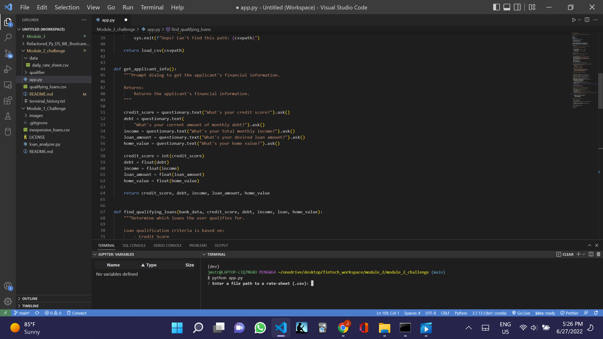

# Second Challenge Project at Columbia Engineering Fintech Program

This is a command line application using python with the fire and questionary libraries to match applicants with the qualifying loans.

Firstly, the application will ask the user to provide the file to the latest banking data.

Secondly, the loan qualification criteria, provided by the user through responses to the questionary questions, involves the following:

- credit score
- loan size
- debit to income ratio (calculated)
- loan to value ratio (calculated)

Thirdly, if there are qualifying loans, the user will be asked to provide a file path to save the file or if there are no qualifying loans, the user wiil be informed and the application will exit.

---

## Technologies

The technology required to run the application is the following:

Python (developed using 3.7.13 </br>
Fire </br>
Questionary

---

## Installation Guide

install python </br>
pip install fire </br>
pip install questionary </br>

Git clone the repo, and run it, pursuant to the following clone address:

git clone https://github.com/JeffSmith-ok/Module_2_challenge.git

cd Module_2_challenge

python app.py

---

## Usage

The following images shows the `python app.py` command being called and the program beginning by requesting the file path to a rate-sheet (.csv).

The user can drag the daily_rate_sheet.csv in the data folder and paste it in the terminal.

At the end of the program, if there are any qualifying loans, the user will be requested to add the file path to save the file. The qualifying_loans.csv is provided as an example.

## 

---

## Contributors

This is the second of the individual learning challenges.

My contact information is:

Name: Jeffrey M. Smith </br>
Linkedin: https://www.linkedin.com/in/jeffsmith77/ </br>
Personal email: jmstranslate@gmail.com </br>
Phone: 332 238 5209

---

## License

MIT License

Copyright (c) 2022 Jeffrey M. Smith

Permission is hereby granted, free of charge, to any person obtaining a copy
of this software and associated documentation files (the "Software"), to deal
in the Software without restriction, including without limitation the rights
to use, copy, modify, merge, publish, distribute, sublicense, and/or sell
copies of the Software, and to permit persons to whom the Software is
furnished to do so, subject to the following conditions:

The above copyright notice and this permission notice shall be included in all
copies or substantial portions of the Software.

THE SOFTWARE IS PROVIDED "AS IS", WITHOUT WARRANTY OF ANY KIND, EXPRESS OR
IMPLIED, INCLUDING BUT NOT LIMITED TO THE WARRANTIES OF MERCHANTABILITY,
FITNESS FOR A PARTICULAR PURPOSE AND NONINFRINGEMENT. IN NO EVENT SHALL THE
AUTHORS OR COPYRIGHT HOLDERS BE LIABLE FOR ANY CLAIM, DAMAGES OR OTHER
LIABILITY, WHETHER IN AN ACTION OF CONTRACT, TORT OR OTHERWISE, ARISING FROM,
OUT OF OR IN CONNECTION WITH THE SOFTWARE OR THE USE OR OTHER DEALINGS IN THE
SOFTWARE.

```

```
